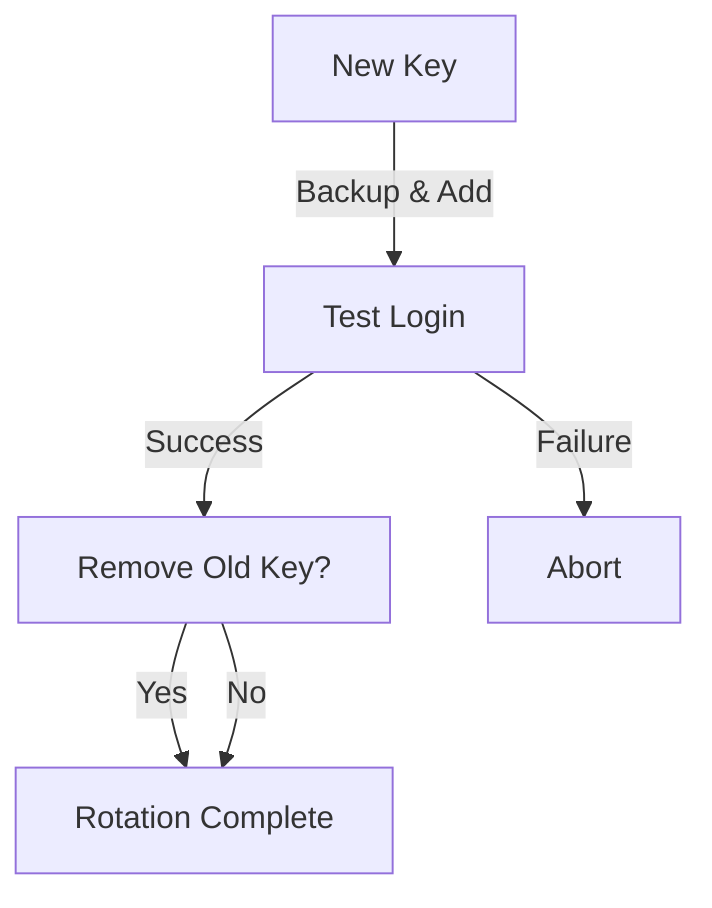

# SSH Key Rotation Script

    

An automated script for safely rotating SSH keypairs on remote Linux servers with comprehensive safety features and audit logging. This tool demonstrates security automation best practices for credential management and access control.

## 🔒 Security Impact

This project demonstrates critical access management principles:
- **Credential Hygiene**: Automated rotation reduces risk of compromised or stale keys
- **Zero-Downtime Security**: Safe key rotation without service interruption
- **Audit Trail**: Comprehensive logging for compliance and forensic analysis
- **Fail-Safe Design**: Multiple safety checks prevent accidental lockouts

### Key Rotation Workflow


## 🛡️ Cybersecurity Relevance

1. **Access Control**: Implements principle of least privilege through key lifecycle management
2. **Incident Response**: Enables rapid credential rotation during security incidents
3. **Compliance**: Supports regulatory requirements for periodic credential rotation
4. **Risk Reduction**: Minimizes exposure window for potentially compromised credentials

## Why Rotate SSH Keys?
- Reduce the risk of compromised or stale keys
- Follow best practices for credential hygiene and access management
- Demonstrate real-world security automation and DevSecOps practices
- Enable rapid response to potential security incidents

## Prerequisites

**Local Machine (where this script is run):**
-   Bash shell environment.
-   Standard SSH client tools: `ssh`, `ssh-keygen`.
-   `ssh-copy-id` utility: This script uses `ssh-copy-id` to transfer the new public key. Ensure it's installed on your local machine.
-   Permissions to create files and directories within your local `~/.ssh/` directory.

**Remote Linux Server:**
-   A running SSH server.
-   The specified `<remote_user>` must exist.
-   The `<remote_user>` must have a `~/.ssh` directory on the remote server, and permissions to write to their own `~/.ssh/authorized_keys` file.
-   Network connectivity from the local machine to the remote server on the SSH port.

## Usage

```bash
./rotate-ssh-key.sh <remote_user> <remote_host>
```

Example:
```bash
./rotate-ssh-key.sh enzo 192.168.64.2
```

### Log Level Configuration
You can set the log level using the `SSH_KEY_ROTATION_LOG_LEVEL` environment variable:

```bash
# Available log levels: DEBUG, INFO, SUCCESS, WARNING, ERROR
SSH_KEY_ROTATION_LOG_LEVEL=DEBUG ./rotate-ssh-key.sh enzo 192.168.64.2
```

Example with different log levels:
```bash
# Run with INFO level (default)
./rotate-ssh-key.sh enzo 192.168.64.2

# Run with DEBUG level for detailed output
SSH_KEY_ROTATION_LOG_LEVEL=DEBUG ./rotate-ssh-key.sh enzo 192.168.64.2

# Run with WARNING level for minimal output
SSH_KEY_ROTATION_LOG_LEVEL=WARNING ./rotate-ssh-key.sh enzo 192.168.64.2
```

## 🛡️ Safety Features
This script includes several important safety measures to minimize risks during key rotation:
-   **Login Verification:** Crucially, after adding the new public key to the remote server, the script performs an SSH login test using the new private key. The script will not proceed to remove old keys unless this login test is successful.
-   **Authorized Keys Backup:** Before making any changes to the remote `~/.ssh/authorized_keys` file, a timestamped backup (e.g., `~/.ssh/authorized_keys.backup-YYYYMMDD_HHMMSS`) is created on the remote server.
-   **Old Key Identification:** The script attempts to identify your current local `id_rsa.pub` key's fingerprint to help locate it in the remote `authorized_keys` file.
-   **User Confirmation for Deletion:** You will be explicitly prompted before any old key is removed from the remote server's `authorized_keys` file. Deletion only occurs if you confirm.
-   **Detailed Logging:** The script provides structured logs (configurable via the `SSH_KEY_ROTATION_LOG_LEVEL` environment variable) that record each step of the process, aiding in auditing and troubleshooting.

## Example Output (Log Excerpt)
```
2024-05-01 14:35:22 [INFO] Old key fingerprint detected: SHA256:abcdefgh1234567890examplefingerprint
2024-05-01 14:35:23 [INFO] Generating new SSH keypair in /home/user/.ssh/rotated-keys: id_rsa_rotated_2024-05-01_14-35-22
2024-05-01 14:35:24 [DEBUG] New key fingerprint: SHA256:newkeyfingerprint12345
2024-05-01 14:35:24 [DEBUG] New key permissions: -rw------- 1 user user 2602 May 1 14:35 /home/user/.ssh/rotated-keys/id_rsa_rotated_2024-05-01_14-35-22
2024-05-01 14:35:25 [INFO] Copying new public key to 192.168.64.2
2024-05-01 14:35:26 [INFO] Testing login with new key...
2024-05-01 14:35:26 [SUCCESS] Login test successful with new key
2024-05-01 14:35:27 [INFO] Backing up authorized_keys on remote server to ~/.ssh/authorized_keys.backup-2024-05-01_14-35-22
2024-05-01 14:35:27 [INFO] Checking for old key in authorized_keys...
2024-05-01 14:35:28 [WARNING] Old key detected in authorized_keys.
Do you want to remove the old key? [y/N]:
```

## 📸 Screenshots

### Successful SSH Key Rotation and Login Test


## Notes
- Tested on Ubuntu 22.04.
- Requires SSH access to the remote host with permissions to write to the `~/.ssh/authorized_keys` file for the specified remote user.
- The script currently handles a single remote host. Multi-host support could be added in future versions.
- Enhanced with structured logging with multiple log levels (DEBUG, INFO, SUCCESS, WARNING, ERROR).
- Newly generated local SSH keypairs are stored in a subdirectory named `rotated-keys` within your local `~/.ssh/` directory (e.g., `~/.ssh/rotated-keys/id_rsa_rotated_YYYY-MM-DD_HH-MM-SS`).

## Log Levels
The script supports different log levels for better visibility and troubleshooting:

- **DEBUG**: Detailed information for troubleshooting (key fingerprints, permissions)
- **INFO**: Standard operation information
- **SUCCESS**: Operation completed successfully
- **WARNING**: Potential issues that don't stop execution
- **ERROR**: Critical issues that halt execution

## Future Improvements (Planned)
- Multi-server rotation via a `targets.txt` file
- Dry-run option to preview changes without applying them
- Automatic rollback if login verification fails
- Support for Ed25519 and other modern key types
- Key passphrase support with secure handling
- Configurable key paths and naming conventions

## Installation

### Quick Start

1. **Clone the repository:**
   ```bash
   git clone https://github.com/lucchesi-sec/ssh-key-lifecycle-manager.git
   cd ssh-key-lifecycle-manager
   ```

2. **Make script executable:**
   ```bash
   chmod +x rotate-ssh-key.sh
   ```

3. **Run the script:**
   ```bash
   ./rotate-ssh-key.sh <username> <hostname>
   ```

### Advanced Setup

#### Multiple Key Management

Create an `old-keys.txt` file to specify additional keys for cleanup:

```bash
# Example old-keys.txt content
~/.ssh/id_rsa_old_2021.pub
/etc/ssh/keys/departed_user_key.pub
~/.ssh/backup_keys/legacy_key.pub
```

#### Environment Configuration

```bash
# Set default log level
export SSH_KEY_ROTATION_LOG_LEVEL=INFO

# Create output directory
mkdir -p example-output

# Run with custom settings
./rotate-ssh-key.sh user@server.com
```

## Security Considerations

### Key Management Best Practices

1. **Regular Rotation Schedule**
   - Implement automated rotation every 90 days
   - Use configuration management for enterprise deployment
   - Monitor rotation success through audit logs

2. **Access Control**
   - Limit script execution to authorized personnel
   - Use dedicated service accounts for automation
   - Implement approval workflows for production systems

3. **Backup and Recovery**
   - Maintain secure backup of authorized_keys files
   - Test recovery procedures regularly
   - Document emergency access procedures

4. **Audit and Compliance**
   - Log all rotation activities
   - Integrate with SIEM systems
   - Generate compliance reports

### Enterprise Deployment

```bash
# Example automation script
#!/bin/bash

# Multi-server rotation
for server in $(cat production_servers.txt); do
    ./rotate-ssh-key.sh service_account $server
    
    # Wait between rotations
    sleep 30
done

# Generate compliance report
./generate_rotation_report.sh
```

## Integration Examples

### Ansible Integration

```yaml
---
- name: Rotate SSH keys across infrastructure
  hosts: all
  tasks:
    - name: Run SSH key rotation
      script: rotate-ssh-key.sh {{ ansible_user }} {{ inventory_hostname }}
      delegate_to: localhost
```

### Cron Automation

```bash
# Weekly rotation on Sundays at 2 AM
0 2 * * 0 /opt/ssh-key-manager/rotate-ssh-key.sh service_user production_server
```

### Monitoring Integration

```bash
# Integration with monitoring systems
./rotate-ssh-key.sh user server 2>&1 | \
    tee -a /var/log/key-rotation.log | \
    logger -t ssh-key-rotation
```

## Troubleshooting

### Common Issues

1. **Permission Denied**
   ```bash
   # Check SSH key permissions
   ls -la ~/.ssh/
   
   # Fix permissions if needed
   chmod 600 ~/.ssh/id_rsa*
   chmod 644 ~/.ssh/id_rsa*.pub
   ```

2. **Login Test Failures**
   ```bash
   # Test manually
   ssh -i ~/.ssh/rotated-keys/id_rsa_rotated_YYYY-MM-DD_HH-MM-SS user@server
   
   # Check SSH configuration
   ssh -v user@server
   ```

3. **Network Connectivity**
   ```bash
   # Test basic connectivity
   nc -zv server 22
   
   # Check SSH service
   ssh user@server "sudo systemctl status ssh"
   ```

### Debug Mode

```bash
# Enable maximum verbosity
SSH_KEY_ROTATION_LOG_LEVEL=DEBUG ./rotate-ssh-key.sh user server

# Bash debug mode
bash -x ./rotate-ssh-key.sh user server
```

## Contributing

1. Fork the repository
2. Create a feature branch
3. Implement changes with appropriate tests
4. Submit a pull request

### Development Setup

```bash
# Test environment setup
vagrant up test-server

# Run tests
./tests/run_tests.sh

# Code quality checks
bash -n rotate-ssh-key.sh  # Syntax check
shellcheck rotate-ssh-key.sh  # Static analysis
```

## License

This project is licensed under the MIT License - see the LICENSE file for details.

## Support

For support and questions:
- GitHub Issues: Report bugs and feature requests
- Security Issues: Contact maintainers directly
- Documentation: See inline comments in script

## Changelog

### v2.0.0
- Added multi-key cleanup from old-keys.txt
- Enhanced logging system with configurable levels
- Improved error handling and safety checks
- Added comprehensive documentation

### v1.0.0
- Initial release with basic key rotation
- Login verification and backup features
- Single key rotation capability